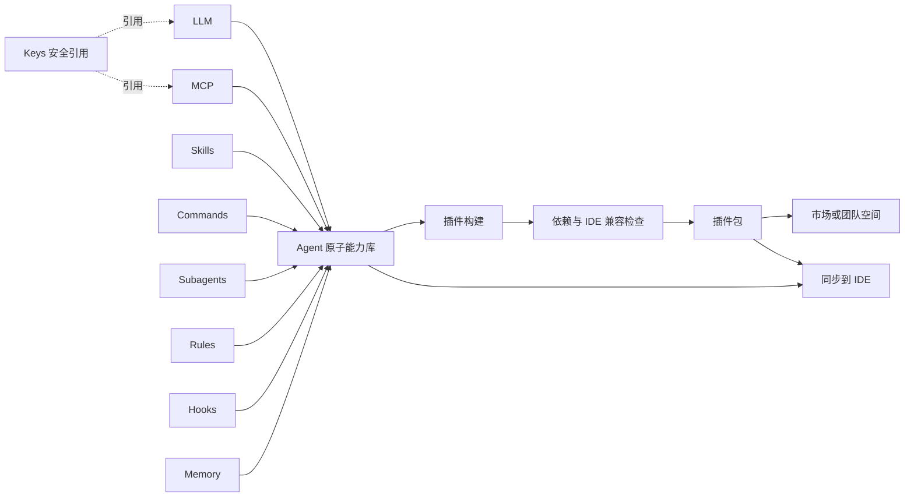
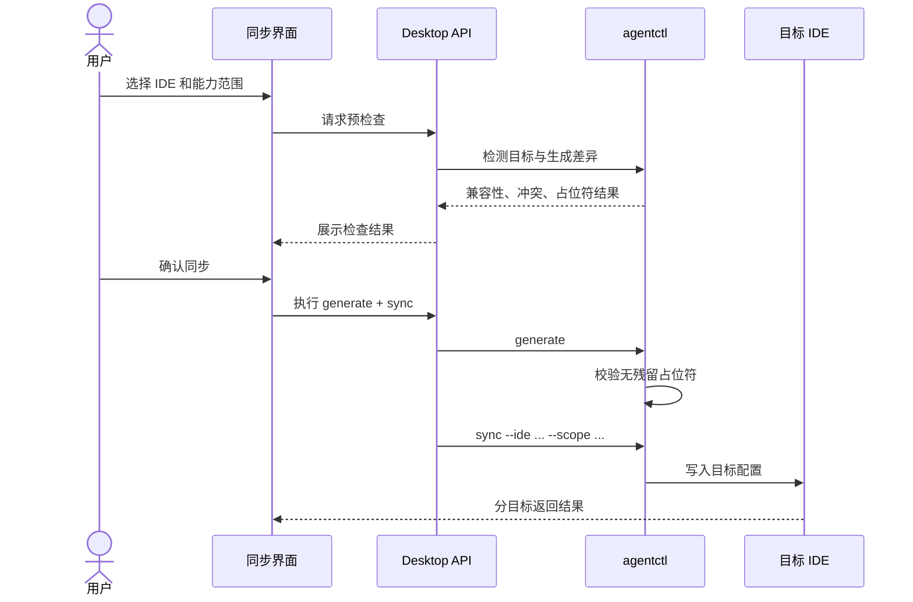

# AgentBuddy 环境控制台 UI 重设计

- **日期**：2026-08-15
- **状态**：设计已形成，待用户审阅
- **方向**：A - 环境控制台
- **原型**：`.superpowers/brainstorm/51912-1786767441/content/02-control-tower-decision.html`
- **范围**：桌面端信息架构、核心工作流、协作能力与商业额度表达

## 1. 背景

AgentBuddy 已具备 LLM、MCP、Skills、Rules、Commands、Subagents、Hooks、Memory、插件和多 IDE 同步能力，但现有界面以功能页堆叠为主，默认入口偏向插件市场，无法直接表达产品的核心价值：管理 AI 开发环境，并把配置可靠地交付到多个 IDE。

本次设计将产品重构为“环境控制台”。它不改变 Agent 原子能力的独立生命周期，也不把这些能力收进插件构建器。插件是能力的组合与分发产物，同步是配置从 AgentBuddy 到 IDE 的独立交付流程。

## 2. 目标

1. 用户进入应用后，能立即判断 IDE 连接、配置差异、Token 用量和同步健康度。
2. IDE、Token、Agent、插件和同步成为清晰的一级工作域。
3. LLM、MCP、Skills、Commands、Subagents、Rules、Hooks、Memory 保持独立管理和独立同步。
4. 插件构建只负责引用、组合、检查、打包和分发原子能力。
5. 高频操作保持直接，复杂操作按步骤引导。
6. 提供“我的”、团队空间、自动推送、IDE 会话共享和 IDE Token 用量查询的产品入口。
7. 商业化采用安静的额度表达，不制造“专业版”功能焦虑。

## 3. 非目标

- 不在本次设计中重写现有 Agent 配置编辑器的业务逻辑。
- 不合并原子能力的数据模型或同步范围。
- 不把 Keys 当作 Agent 原子能力或默认插件内容。
- 不将团队空间和自动推送伪装成本地已具备的能力；它们需要后续服务端契约支持。
- 不以营销落地页替代实际工作台。
- 不用一次发布强行完成所有新增服务能力，实施应按阶段交付。

## 4. 核心模型

### 4.1 一级工作域

| 工作域 | 核心职责 | 首屏问题 |
|---|---|---|
| 环境总览 | 汇总连接、差异、用量与同步健康度 | 当前环境是否健康，哪里需要处理？ |
| IDE 管理 | 连接 IDE、查看能力支持、查询用量、共享会话 | 每个 IDE 当前是什么状态？ |
| Token 市场与管理 | 发现可购买 Token 服务，管理已购额度、Keys 和用量 | Token 服务是否值得购买，已购额度是否安全可用？ |
| Agent 管理 | 管理八类可复用原子能力 | Agent 能力由哪些独立配置构成？ |
| 插件市场 | 发现、比较、安装可复用的插件组合 | 哪些现成组合适合当前任务？ |
| 插件管理 | 管理我创建、已安装、已发布的插件资产和版本 | 我的插件现在是什么状态？ |
| 同步到 IDE | 选择目标和范围，预检查后生成并同步 | 哪些内容要交付到哪些 IDE？ |
| 我的 | 管理个人资产、发布、收藏、活动和额度 | 我拥有和使用了什么？ |
| 团队空间 | 管理共享资产、成员、角色和配置基线 | 团队共同维护和交付什么？ |
| 自动推送 | 按触发条件向目标 IDE 推送已审核变更 | 哪些变更可以自动交付？ |

“环境总览”是默认入口。“同步到 IDE”同时保留侧栏入口和顶部主操作，体现其高频、跨域属性。

### 4.2 Agent 原子能力

Agent 管理由八个独立能力入口构成：

| 能力 | 管理内容 | 独立操作 |
|---|---|---|
| LLM 配置 | Provider、协议、模型、路由、网关 | 创建、编辑、启停、测试、同步 |
| MCP 配置 | 工具服务、启动参数、环境变量 | 搜索、安装、编辑、启停、同步 |
| Skills 管理 | 技能来源、版本和安装状态 | 搜索、安装、升级、启停、同步 |
| Commands | 斜杠命令与参数模板 | 创建、编辑、启停、同步 |
| Subagents | 角色、提示词和工具权限 | 创建、编辑、启停、同步 |
| Rules | 项目约束、适用范围和执行规范 | 创建、编辑、启停、同步 |
| Hooks | 会话与工具事件触发动作 | 创建、编辑、启停、同步 |
| Memory | 用户记忆和技能记忆 | 创建、编辑、导入导出、启停、同步 |

每个入口显示总数、启用数和异常状态。进入后复用现有独立页面，不在总览卡片内塞入完整编辑器。

### 4.3 Keys 与 Token 的边界

Keys 是独立安全资源，属于 Token 管理域，不属于 Agent 原子能力。LLM 和 MCP 通过引用使用 Key；插件导出时只保存引用或环境变量名，默认不包含明文密钥。Token 市场负责发现和购买服务，Token 管理负责已购额度、密钥和消耗；LLM 配置负责 Provider、协议、模型、路由和网关参数。

Token 市场与管理包含四个子视图：

1. **Token 市场**：按 Provider、协议、模型兼容性、价格和额度比较服务。
2. **我的 Token**：已购买/已领取额度、到期时间、分配状态和可用余额。
3. **密钥**：现有 Keys 管理、安全状态和引用关系。
4. **用量**：按 Provider、IDE、模型和时间查看实际或估算消耗。

Provider、协议、模型、主备路由和网关状态只在 Agent → LLM 配置中维护；Token 页面展示兼容性和消耗，不复制 LLM 配置表单。

### 4.4 Agent 与插件的边界

插件构建器不得承担原子能力的创建和完整编辑。用户发现能力缺失时，从构建器跳转到对应管理页创建，返回后刷新选择列表并保留构建草稿。

## 5. 导航与页面结构

### 5.1 桌面布局

- 顶部栏：品牌、环境总览快捷入口、同步历史、在线状态和“同步到 IDE”主按钮。
- 左侧栏：本地管理、协作、市场 Explorer 三个分组，保持稳定宽度和清晰选中态。
- 主内容区：页面标题、状态摘要、主要操作和当前工作内容。
- 全局反馈：Toast 用于短结果；长任务使用可展开日志/进度面板；冲突和危险操作使用对话框。

### 5.2 导航分组

**本地管理**：环境总览、IDE 管理、Agent 管理、插件管理、同步到 IDE。这里承载本机环境、原子能力、已拥有资产和交付动作。

**协作**：我的、团队空间、自动推送。

**市场 Explorer**：市场总览、MCP 市场、Skill 市场、插件市场、LLM / Token 市场。市场总览负责按资源类型分流，四个 Explorer 分别负责发现、筛选、比较和安装；安装或购买完成后回到对应的本地管理域。

插件管理负责“我的插件 / 已安装 / 发布记录”，并提供“构建插件”主操作。插件构建是独立的复杂制作流程，不等同于插件管理。MCP、Skill、插件和 LLM / Token 市场均是发现入口，不取代本地配置与资产管理。Token 管理页内提供“我的 Token / 密钥 / 用量”；LLM 的 Provider、协议、模型、路由和网关仍只在 Agent 管理中维护。

### 5.3 视觉方向

- 视觉语义：安静、工具化、可扫描，避免营销式大标题和装饰性卡片堆叠。
- 主色：深墨绿用于结构，青绿用于正常/选中，锈红用于主操作与需要关注的状态，浅黄用于额度提示。
- 字体：正文采用清晰的人文无衬线字体，页面级标题可使用克制的衬线字体；紧凑面板不使用大号展示字。
- 圆角：工具面板和卡片不超过 8px。
- 图标：生产实现使用项目已有图标库；若无统一图标库，采用 Lucide，不手绘 SVG。
- 动效：仅用于页面进入、同步进度和状态变化，不为每张卡片添加无意义动画。

## 6. 核心流程

### 6.1 环境检查与修复

1. 用户进入环境总览。
2. 系统并行加载 IDE 检测、同步状态、配置差异和用量摘要。
3. 正常项以紧凑状态显示，异常项按影响程度排序。
4. 简单差异可直接“同步选中项”。
5. 冲突、缺失依赖或跨团队变更进入引导式同步流程。

### 6.2 Agent 能力管理

1. 用户进入 Agent 管理，查看八类能力摘要。
2. 选择一个能力进入现有独立管理页。
3. 编辑保存后执行 `generate + sync` 的现有约束，或明确选择仅保存草稿。
4. 返回 Agent 管理时刷新数量、启用状态和同步状态。

能力卡片只承担导航和摘要，不复制业务表单状态。

### 6.3 插件市场、管理与构建

插件市场和插件管理是两个不同的用户任务：市场用于发现、比较和安装；管理用于查看资产状态、升级、启停、发布记录和同步状态。插件管理页提供进入构建向导的明确入口，但构建向导不替代资产管理。

插件市场安装插件后，用户进入插件管理查看安装状态、版本和目标 IDE 兼容性。我的插件可以从管理页继续构建、发布或同步。

插件市场提供三套可切换的资源交互模式，用同一套资源数据驱动，避免不同资源类型出现不一致的安装体验：

1. 快速抽屉：适合用户在列表中快速浏览资源说明、包含能力、兼容性和安装前检查。抽屉不打断市场浏览路径，主操作是“检查依赖并安装”。
2. 完整详情页：适合高风险或信息密集资源，展示版本变更、兼容性、能力清单、安全说明、评分和发布者信息。详情页适合从外部链接、搜索结果或团队推荐进入。
3. 安装向导：适合首次安装、存在依赖、需要选择 IDE 目标、涉及团队空间或存在兼容性差异的资源。向导必须把用户带过依赖检查、安装范围、变更预览和完成结果四个状态。

插件安装状态机：

1. 资源选择：用户从插件市场、团队推荐或搜索结果选择资源。
2. 资源详情：展示资源价值、发布者、包含能力、版本和安装影响。
3. 依赖检查：检查 MCP、Skills、LLM 引用、Keys 引用、IDE 兼容性和本地版本冲突。
4. 安装范围：选择仅本机、指定 IDE、团队空间或稍后同步。
5. 同步预览：展示将写入的本地资源、目标 IDE、不会包含明文密钥的安全说明和兼容性降级项。
6. 安装结果：展示成功、部分成功或失败项；成功后提供“继续浏览”和“打开插件管理”，失败时提供重试和查看冲突详情。

安装成功后的默认落点是插件管理，而不是继续停留在市场。市场只负责发现和启动安装；资产状态、升级、启停、发布和再次同步都回到插件管理完成。

1. 填写插件身份信息。
2. 从八类原子能力中选择引用项，并按导出策略选择 Keys 引用方式。
3. 系统检查缺失依赖、重复项、敏感信息和目标 IDE 兼容性。
4. 用户预览清单和差异。
5. 保存本地插件、导出 ZIP、发布到市场或共享到团队空间。

简单插件允许在单页快速完成；第一次构建、存在冲突或涉及外部发布时使用步骤引导。

### 6.4 同步到 IDE

同步结果必须按 IDE 展示，不用单个“成功”掩盖部分失败。失败项支持查看日志和仅重试失败目标。

### 6.4 Token 市场与已购额度

1. 用户从 Token 市场按 Provider、协议/模型兼容性、价格、额度和数据来源比较服务。
2. 查看方案时明确一次性额度、周期额度、按量计费、有效期和退款/失效规则。
3. 购买或领取后，资产进入“我的 Token”，展示剩余额度、绑定的 Key、可用 IDE 和用量入口。
4. Token 市场不编辑 Provider 参数；用户需要配置模型、协议或路由时跳转 Agent → LLM 配置。

### 6.5 IDE Token 用量

1. IDE 列表显示本月用量摘要、额度比例和数据来源状态。
2. 详情按时间、模型、会话和用途展示消耗。
3. 数据优先级为 Provider 官方接口、IDE 可用接口、本地会话估算。
4. 估算数据必须标注“本地估算”、计算范围和最后更新时间，不与官方数据混合成单一精确值。
5. 无法读取时显示“不支持查询”，不显示伪造的零值。

### 6.6 IDE 会话共享

1. 从 IDE 行进入“共享会话”。
2. 选择会话及允许包含的文件引用。
3. 设置只读/可协作、成员范围和有效期。
4. 系统执行敏感信息检查并展示排除项。
5. 生成团队内共享或可撤销的外部链接。

默认是 7 天有效的只读快照。可协作模式从快照创建独立分支，不修改原始会话。Token、密钥、未选择文件和本机绝对路径不进入共享内容。

### 6.7 团队空间与自动推送

团队空间维护共享插件、配置基线、成员角色、会话和交付目标。自动推送规则由“触发条件 + 资产版本 + 审核门槛 + 目标 IDE + 失败策略”组成。

自动推送只处理已保存且通过预检查的版本。涉及 Keys 变更、权限扩大或敏感范围变化时必须人工确认。失败时停止该目标的后续推送并通知所有者，不自动覆盖未知本地修改。

## 7. 数据与状态边界

前端保持现有 Pinia 按领域拆分，不创建一个包含所有控制台数据的巨型 Store。

| 状态域 | 来源 | 消费页面 |
|---|---|---|
| IDE 检测与能力矩阵 | Desktop API / `agentctl.lib.ide` | 总览、IDE、同步 |
| Agent 原子能力 | 现有 LLM/MCP/Skill/Rules 等 Stores | Agent、插件构建、同步 |
| Keys 与引用关系 | Keys Store / Desktop API | Token、LLM、MCP、插件构建 |
| 同步任务 | Sync Store / SSE | 总览、同步、自动推送 |
| 用量记录 | Provider/IDE API 或本地估算服务 | 总览、IDE、Token、我的 |
| 个人与团队资产 | Server API | 我的、团队、插件管理 |
| 分享与推送规则 | Server API + 本地执行代理 | IDE、团队、自动推送 |

环境总览只聚合各领域的只读摘要。任何写操作仍由所属领域 Store 执行，避免总览成为第二套业务逻辑。

## 8. 页面状态

所有一级页面和核心组件必须覆盖：

- **Loading**：保留稳定布局，使用骨架或局部进度，不让整个工作台白屏。
- **Empty**：说明缺少的对象并提供一个直接操作，例如“连接 IDE”或“创建 LLM 配置”。
- **Error**：展示用户可理解的原因、数据来源和重试入口；技术日志折叠展示。
- **Partial success**：同步、用量和团队请求允许部分成功，逐项标识结果。
- **Offline**：本地能力继续可用；云端市场、团队和分享显示离线状态及最后缓存时间。
- **Permission**：隐藏不可执行操作会造成误解时，保留禁用态并说明所需角色。
- **Conflict**：显示本地、目标和建议处理方式，不默认覆盖。

## 9. 安全与隐私

1. Keys 默认只显示名称、用途、引用数和校验状态，值保持遮罩。
2. 前端日志、用量导出、会话共享和插件导出不得包含 Token、API Key 或完整本机路径。
3. 外部分享链接可撤销、可过期，并记录创建者和访问审计。
4. 团队角色至少区分所有者、管理员、编辑者和查看者；服务端执行权限校验。
5. 自动推送记录规则版本、触发源、执行人/服务身份、目标、结果和回滚信息。
6. 插件发布前检查敏感字段、`${VAR}` 残留、缺失引用和不安全文件。
7. 所有云端交互明确展示上传范围；本地配置不因登录自动上传。

## 10. 商业额度表达

核心的本地管理、手动同步、Agent 原子能力和本地插件构建不按版本锁定。可计量的云端或运营成本能力使用额度：

- Token 智能推荐次数。
- 市场发布数量。
- 团队空间数量和成员数量。
- 自动推送规则数量。

额度接近上限时在相关操作附近提示；达到上限后提供单项扩容和捐赠入口，不在全局导航持续展示“专业版”广告。历史资产仍可查看和手动使用。

## 11. 响应式与可访问性

- 桌面端优先支持 1024px 以上工作区；内容区使用明确的网格最小宽度。
- 800px 以下侧栏收为图标导航，图标提供 Tooltip 和可访问名称。
- Agent 能力卡由四列降为两列，再在窄屏降为单列。
- IDE 行在窄屏隐藏次要元数据，保留名称、状态和操作菜单。
- 所有触控目标不小于 44x44px，键盘焦点清晰可见。
- 文本和状态色满足 WCAG 2.1 AA；成功、警告、错误同时使用图标或文字。
- 固定格式组件设置稳定尺寸，加载和动态数字不引发布局跳动。
- 页面不得出现横向溢出，长名称使用换行或截断并提供完整 Tooltip。

## 12. 实施分期

### 阶段 1：控制台骨架与现有能力重组

- 新默认入口、一级导航、环境总览。
- Agent 八类原子能力总览与现有页面跳转。
- Token 市场与管理聚合市场商品、已购额度、Keys 和用量，不承载 LLM 路由配置。
- 插件市场负责发现与安装；插件管理聚合我的插件、已安装、发布记录和版本状态；插件构建保持独立向导。
- 同步入口和现有同步状态重构。

阶段 1 主要复用现有 API 和 Stores，可以独立发布。

### 阶段 2：IDE 观测与安全分享

- IDE Token 用量采集、来源标识和详情页。
- 会话快照、敏感信息检查、权限和撤销机制。
- 需要新增 Desktop API、Provider 适配和 Server 分享契约。

### 阶段 3：团队交付自动化

- 我的资产与额度。
- 团队空间、角色、共享基线。
- 自动推送规则、审计、失败暂停和通知。
- 需要服务端持久化、鉴权、审计和本地执行代理。

每个阶段单独制定实施计划和验收，不让阶段 2/3 阻塞阶段 1 的 UI 重构。

## 13. 测试策略

### 13.1 单元与组件测试

- 导航配置正确分组并映射到唯一页面。
- Agent 总览固定包含八类能力，数量与启用状态来自对应 Store。
- 插件构建只保存能力引用，不复制明文 Keys。
- 用量来源标签按官方、IDE、估算和不支持四种状态显示。
- 权限、额度、离线、空数据和错误状态可独立渲染。

### 13.2 集成测试

- 保存 LLM/MCP 配置后执行 generate + sync，并刷新总览状态。
- 插件构建引用现有能力，缺失依赖能阻止发布但可保存草稿。
- 多 IDE 同步部分失败时，成功目标不回滚，失败目标可单独重试。
- 会话共享排除 Keys、未选择文件和本机绝对路径。
- 自动推送遇到未知本地修改时停止并进入人工处理。

### 13.3 浏览器与视觉验证

- 在 1440x900、1024x768、768x1024、390x844 视口验证布局。
- 验证无横向溢出、文字遮挡、卡片嵌套和操作位移。
- 通过键盘完成导航、同步引导和共享引导。
- 检查 Loading、Empty、Error、Offline、Permission、Conflict 和部分成功状态。
- 对环境总览、Agent 管理、IDE 管理、插件构建和同步结果建立关键截图基线。

## 14. 验收标准

- [ ] 应用默认进入环境总览，不再默认进入插件市场。
- [ ] IDE、Token 市场与管理、Agent、插件市场、插件管理、同步均为可直接识别的一级工作域。
- [ ] Agent 管理独立展示 LLM、MCP、Skills、Commands、Subagents、Rules、Hooks、Memory 八类能力。
- [ ] 每类 Agent 能力保留独立创建、编辑、启停和同步入口。
- [ ] Keys 位于 Token 管理域，插件和会话共享默认不包含明文密钥。
- [ ] 插件构建仅组合已有能力，并支持跳转创建缺失能力后返回草稿。
- [ ] 插件市场、插件管理和插件构建分别承担发现安装、资产生命周期和制作组合，不互相替代。
- [ ] Token 市场展示商品和购买决策，Token 管理展示已购额度、Keys 与用量；LLM 配置独占 Provider、协议、模型、路由和网关。
- [ ] 同步结果按 IDE 和能力范围显示，支持部分失败和定向重试。
- [ ] 复杂同步、插件发布和会话共享使用引导流程；简单操作无需强制多步。
- [ ] 我的、团队空间和自动推送具有明确入口和状态边界。
- [ ] IDE 用量显示数据来源，不支持查询时不伪造数据。
- [ ] 会话共享默认只读、可撤销、可过期，并排除敏感数据。
- [ ] 商业额度只作用于明确的计量能力，不锁定核心本地工作流。
- [ ] 390px 至 1440px 视口无横向溢出和内容遮挡。

## 15. 已确认决策

1. 采用 A“环境控制台”作为永久主框架。
2. 复杂任务使用 B 式步骤引导，不把整个应用改成向导。
3. IDE、Token 市场与管理、Agent、插件市场、插件管理、同步是一级工作域。
4. Agent 原子能力保持八个独立管理入口。
5. Keys 独立管理，作为安全引用被其他能力使用。
6. 插件是组合与分发层，不是能力管理入口。
7. “我的”、团队空间、自动推送、IDE 会话共享和 IDE Token 用量纳入产品设计。
8. 商业化以次数、数量和捐赠表达，不突出“专业版本”。
9. 实施分三阶段，优先交付可复用现有能力的控制台骨架。